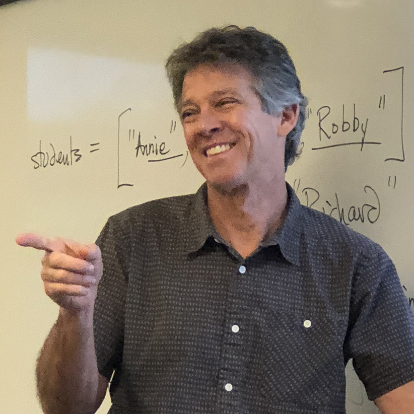

Resume - Richard White
========================

Contact Information
-------------------

P.O. Box 50318  
Pasadena, CA  91115  
rwhite@crashwhite.com  
rwhite@polytechnic.org

Personal Statement
------------------

I am a creative, high-energy, life-long educator who enjoys guiding students in their learning of **computer science** and **physics**. As technology has become increasingly important, I have enjoyed spending more time developing and teaching various computer science curricula, for use both with my own students and in training other educators.

Work Experience	
---------------

* Teacher, Polytechnic School, Pasadena, CA.  2004-present
    * Developed Computer Science program, including curriculum development and teaching CS courses:
        * Intro to Computer Science - a Python-based single-semester elective (2010-present)
        * AP Computer Science A - a Java-based year-long elective (2013-present)
        * Advanced Topics in Computer Science - a post-AP single-semester elective covering advanced algorithms and data structures (2016-present)
    * Conduct introductory workshops for students in Open Source Software, Linux, server administration
    * Developed and taught Adult Education Computer Science course for wider school community
    * Developed and taught annual "Hour of Code" presentations
    * Teach two Advanced Placement Physics C courses: Mechanics and Electricity & Magnetism (12 grade, 2004-present)
    * Taught Conceptual Physics (9th grade, 2004-2013).
    * Chaired the Faculty Technology Committee, responsible for training teachers in educational technology.
    * Served on school's Admissions Committee, Education Committee

* Teacher, Partnership for Success!, Pasadena CA.  2019-2022
    * Wrote curriculum and teach computer science for six-week summer program for first-generation students in Pasadena Unified School District
    
* Teacher, Berkeley High School, Berkeley, CA.  1997-2002, 2003-2004
    * Taught Advanced Placement Physics, 11th & 12th grade Physics, Integrated Science, and Physical Science
    * Developed and maintained websites to supplement classroom content
    * Developed and coordinated innovative extra-curricular physics outings including Physics of Rockclimbing, Physics of Amusement Parks, Physics Adventure Race
    * Mentored Berkeley High science teachers for Beginning Teacher and Support (BTSA) program
    * Served as Master teacher for 3 student teachers at UC Berkeley and Mills College
    * Acted as Science Department Tech Mentor, assisting other teachers with hardware, software, and networking issues

* Teacher, Science Dept. Chair, Yucca Valley High School, Yucca Valley, CA. 1991-1997, 2003
    * Taught Algebra & Algebra II courses (2003)
    * Taught 11th & 12th grade Physics, Applied Physics, 9th & 10th grade Physical Science, Earth Science, and Integrated Science courses (1991-1997)
    * Served as Science Dept. Chair, including serving on the school's site-based management Academic Council and the principal's Core advisory committee (1993-1995).
    * Conducted staff development presentations and faculty in-services in computer applications and the Internet
    * Directed the Vertical Club, a student rockclimbing organization

* Teacher, Computer Dept. Chair, Bishop Montgomery High School, Torrance, CA. 1986-1991
    * Taught Intro & Advanced Computer Programming, Computer Applications courses
    * Developed the school's computer science curriculum, conducted teacher in-services in the use of desktop computers, installed and operated the networked Computer Lab

Related Experience
------------------

* Member of Association for Computing Machinery (ACM)
* Computer languages known: Python, Java, HTML/CSS, PHP, MySQL
* California Single-Subject Teaching Credential in Physical Science (#200196774)
* Performed on-site WASC/CAIS accreditation visitations (2006, 2020)
* Presenter, Computer-Using Educators Conference (2007)
* Consultant, Eeps Media, Inc., Oakland, CA  
  Performed classroom alpha testing of "Fathom" data analysis software (2002-2004).
* Consultant, Britannica.com Inc., Chicago, IL 
* Assisted in design review of Internet-delivered educational software (2001).
* Coordinated and led summer trips to France for high school students  (1995-2003).
* Assisted in design review of multimedia educational software (1999).

Education
---------

* California State University, San Bernardino  
  1996 - 2002,  M.A. in Education, Instructional Technology awarded 12/02
* Professional Clear Credential in Physical Science awarded 5/96  
  California State University, Dominguez Hills  
  1989 - 1991,  Preliminary Credential in Physical Science awarded 9/91
* California State University, Humboldt
  1983 - 1986, B.A. in Geology awarded 1/86
* University of California, Irvine  
  1978 - 1981, majored in Information and Computer Science

